Q1,2,3,4,5:
j'ai cree le projet est le ompte service
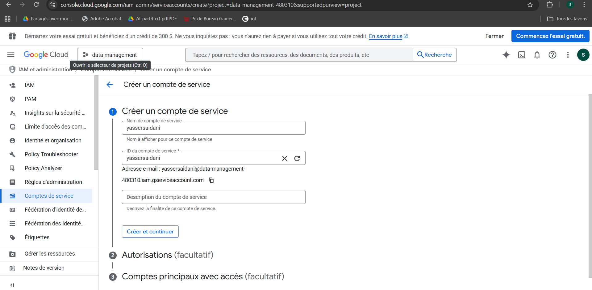

Q6:
ajouter le clé.
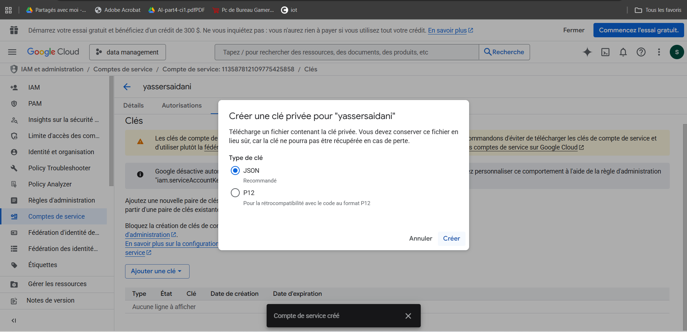

Q7:
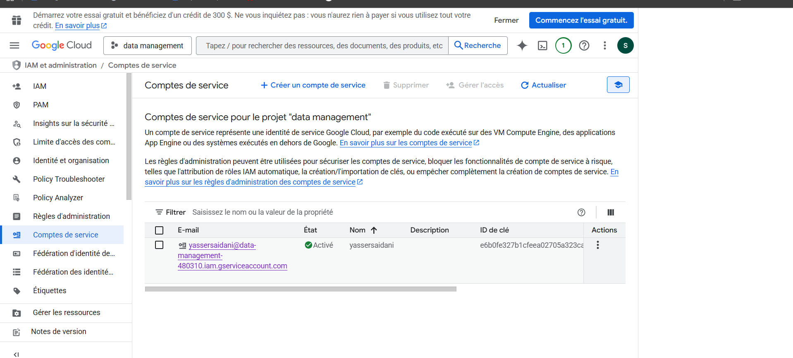

Q8:
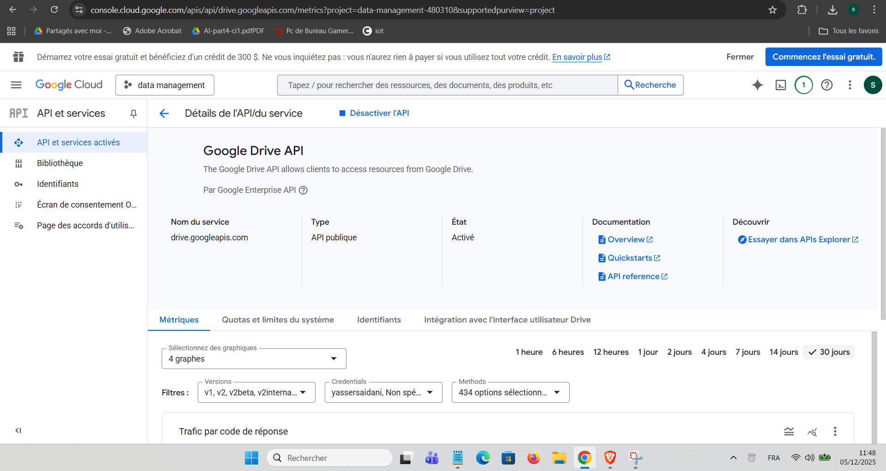

Q9:
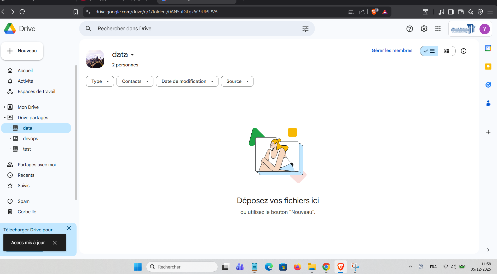

Q10:
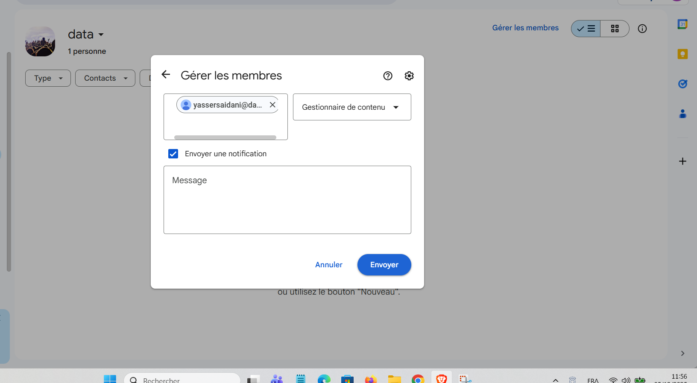

Q11:
pip install -r requirements.txt
pip install dvc dvc-gdrive

Q12:
dvc init
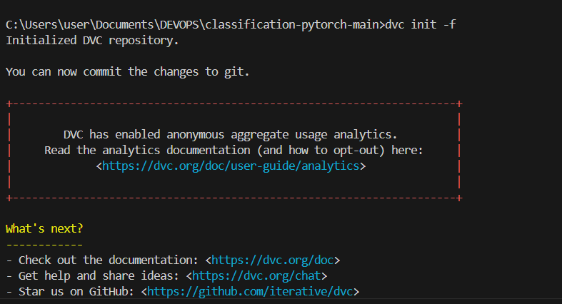
Q13:
dvc add data 
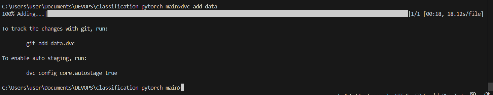
git add data.dvc 

Q14:

Q15:
dvc remote modify gdrive_remote gdrive_use_service_account true

Q16:
dvc remote modify gdrive_remote gdrive_acknowledge_abuse true

Q17: 
dvc remote modify gdrive_remote --local gdrive_service_account_json_file_path data-management-480310-e6b0fe327b1c.json

Q18:
dvc config core.autostage true
Q19:
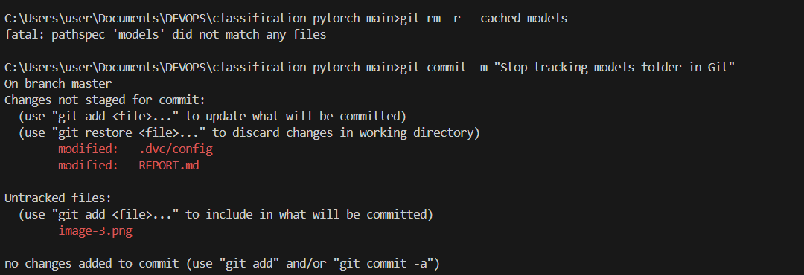

Q20:
dvc push
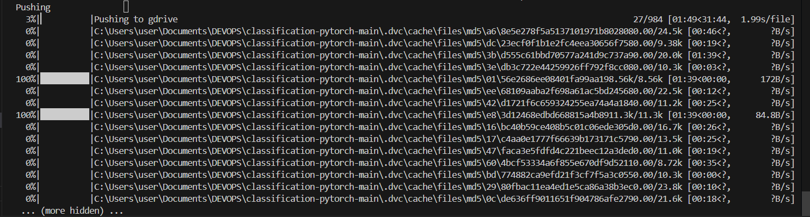
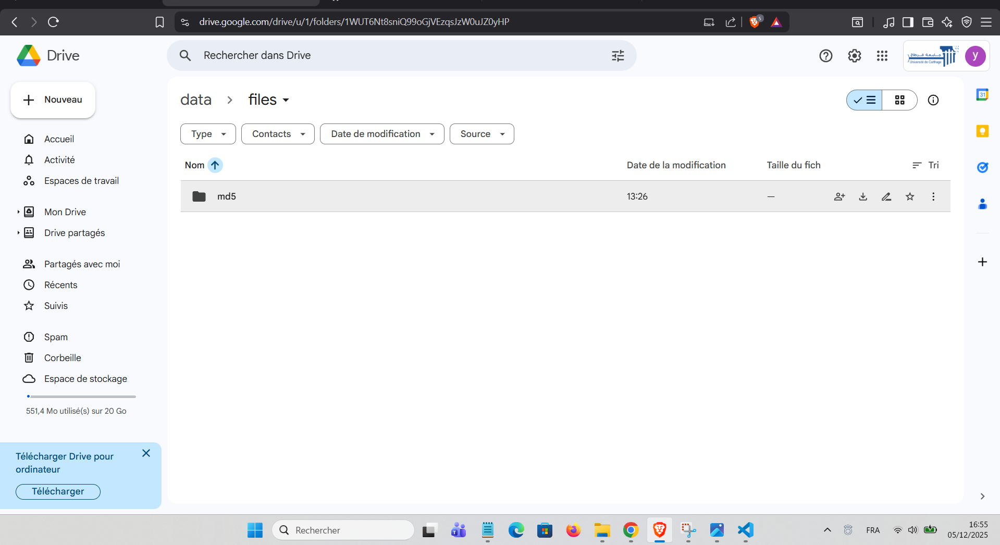
